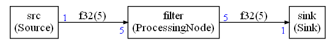
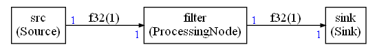
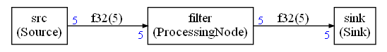

# Dynamic Data Flow

This feature is illustrated in the [Example 10 : The dynamic dataflow mode](examples/example10/README.md)

Versions of the compute graph corresponding to CMSIS-DSP Version >= `1.14.3` and Python wrapper version >= `1.10.0` are supporting  a new dynamic / asynchronous mode.

 With a dynamic flow, the flow of data is potentially changing at each execution. The IOs can generate or consume a different amount of data at each execution of their node (including no data).

This can be useful for sample oriented use cases where not all samples are available but a processing must nevertheless take place each time a subset of samples is available (samples could come from sensors).

With a dynamic flow and scheduling, there is no more any way to ensure that there won't be FIFO underflow of overflow due to scheduling. As consequence, the nodes must be able to check for this problem and decide what to do.

* A sink may decide to generate fake data in case of FIFO underflow
* A source may decide to skip some data in case of FIFO overflow
* Another node may decide to do nothing and skip the execution
* Another node may decide to raise an error.

With dynamic flow, a node must implement the function `prepareForRunning` and decide what to do.

3 error / status codes are reserved for this. They are defined in the header `cg_status.h`. This header is not included by default, but if you define you own error codes, they should be coherent with `cg_status` and use the same values for the 3 status / error codes which are used in dynamic mode:

* `CG_SUCCESS`  = 0 : Node can execute
* `CG_SKIP_EXECUTION` = -5 : Node will skip the execution
* `CG_BUFFER_ERROR` = -6 : Unrecoverable error due to FIFO underflow / overflow (only raised in pure function like CMSIS-DSP ones called directly)

Any other returned value will stop the execution.

The dynamic mode (also named asynchronous), is enabled with option : `asynchronous` of the configuration object used with the scheduling functions.

The system will still compute a synchronous scheduling and FIFO sizes as if the flow was static. We can see the static flow as an average of the dynamic flow. In dynamic mode, the FIFOs may need to be bigger than the ones computed in static mode.  The static estimation is giving a first idea of what the size of the FIFOs should be. The size can be increased by specifying a percent increase with option `FIFOIncrease`.

For pure compute functions (like CMSIS-DSP ones), which are not packaged into a C++ class, there is no way to customize the decision logic in case of a problem with FIFO. There is a global option : `asyncDefaultSkip`. 

When `true`, a pure function that cannot run will just skip the execution. With `false`, the execution will stop. For any other decision algorithm, the pure function needs to be packaged in a C++ class.

`Duplicate` nodes are skipping the execution in case of problems with FIFOs. If it is not the wanted behavior, you can either:

* Replace the Duplicate class by a custom one by changing the class name with option `duplicateNodeClassName` on the graph.
* Don't use the automatic duplication feature and introduce your duplicate nodes in the compute graph

When you don't want to generate or consume data in a node, just don't call the functions `getReadBuffer` or `getWriteBuffer` for your IOs.

## prepareForRunning

The method `prepareForRunning` is needed to check if the node execution is going to be possible.

Inside this function, you have access to methods like:

* `willOverflow`
* `willUnderflow`

In case of several IOs, you may also have:

* `willOverflow1`
* `willOverflow2` 

etc ...

The functions have an interface like:

```C++
bool willOverflow(int nb = outputSize)
```

or

```C++
bool willUnderflow(int nb = inputSize)
```

The `inputSize` and `outputSize` are coming from the template arguments. So, by default the node is using the parameters of the static compute graph.

You may want to read or write more or less than what is defined in the static compute graph. But it must be coherent with the `run` function.

If you use `willOverflow(4)` to check if you can write `4` samples in the output in the `prepareForRunning` function, then in the `run` function you must access to the write buffer by requesting `4` samples with `getWriteBuffer(4)`

If you don't want to write or read on an IO, just don't use the function `getWriteBuffer` and `getReadBuffer` in the `run` function.

It is also possible to use the functions `willOverflow`, `willUnderflow` in the `run` function. It can be used to avoid calling the `getReadBuffer` and `getWriteBuffer` when you nevertheless want to run the node although some FIFOs cannot be used.

**WARNING**: You are responsible for checking if a FIFO is going to underflow or overflow **before** using `getReadBuffer` or `getWriteBuffer`.

If the `getReadBuffer` and `getWriteBuffer` are causing an underflow or overflow of the FIFO, you'll have memory corruptions and the compute graph will no more work.

## Graph constraints

The dynamic mode is using a synchronous graph as average / ideal case. But it is important to understand that we are no more in static / synchronous mode and some static graph may be too complex for the dynamic mode. Let's take the following graph as example:



The generated schedule is:

```
src
src
src
src
src
filter
sink
sink
sink
sink
sink
```

If we use a strategy of skipping the execution of a node in case of overflow / underflow, what will happen is:

* Schedule iteration  1
  * First `src` node execution is successful since there is a sample
  * All other execution attempts will be skipped 
* Schedule iteration  2
  * First `src` node execution is successful since there is a sample
  * All other execution attempt will be skipped 
* ...
* Schedule iteration  5:
  * First `src` node execution is successful since there is a sample
  * 4 other `src` node executions are skipped
  * The `filter` execution can finally take place since enough data has been generated


In summary , it is totally useless in asynchronous mode to attempt to run the same node several times in the same scheduling iteration except if we are sure there will always be enough data. In previous example, we see that only the first attempt at running `src` is doing something. Other attempts are always skipped.


Instead, one could try the following graph:



With this graph, each node execution will be attempted only once during an execution.

But the `filter` needs 5 samples, so we need to increase the size of the FIFOs from `1` to `5` or the `filter` node will never be executed. 

It is possible with the option `FIFOIncrease` but it is better to make it explicit with the following graph:



In this case, the FIFO is big enough. `src` node will be executed each time there is a sample. `filter` will execute only when 5 samples have been accumulated in the FIFO. Each node execution is only attempted once during a schedule.


As consequence, the recommendation in dynamic / asynchronous mode is to:

* Ensure that the amount of data produced and consumed on each FIFO end is the same (so that each node execution is attempted only once during a schedule)
* Use the maximum amount of samples required on both ends of the FIFO
  * Here `sink` is generating  at most `1` sample, `filter` needs 5. So we use `5` on both ends of the FIFO
