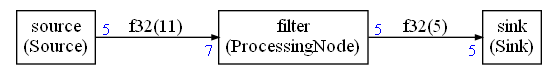
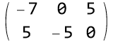

# Mathematical principles

This document explains the mathematical ideas used in the algorithm (Python script) to compute the static (or cyclo-static) scheduling.

The details and demonstrations (for the static scheduling) can be found in the reference paper:

> Static Scheduling of Synchronous Data Flow Programs for Digital Signal Processing
> EDWARD ASHFORD LEE, MEMBER, IEEE, AND DAVID G. MESSERSCHMITT, FELLOW, IEEE

## Static scheduling

The following graph will be used as an example for the explanations:

A topology matrix can be created from each graph where the columns describe the nodes, and the rows describe the edges.

The values represent how many samples are produced or consumed on each edge.

The following matrix `M` is created from the previous graph. The first column represents the filter. The second column represents the sink and the last column represents the source.

The first row means that an execution of the filter is consuming 7 samples on the first edge and execution of the source is producing 5 samples. The sink is not connected to the first edge so the value is 0.

If a node is run `nb` times then the matrix can be used to compute the state of the edges after this execution.

A vector `s` can be used to represent how many time each node is executed. Then `M.s` is the amount of data produced / consumed on each edge.

If `f` is the state of the edges (amount of data on each edge) then, after execution of the nodes as described with `s`, we have:

`f' = M . s + f`

where `f'` is the new state after the execution of the nodes.

If we want to find a scheduling of this graph allowing to stream samples from the source to the sink, then a periodic solution must be found. It is equivalent to finding a solution of:

`M . s = 0`

The theory is showing that if the graph is schedulable, the space of solution has dimension 1. So we can find a solution with minimal integer values for the coefficients by :

* Converting the solution (which may be rational) to integers
* Using the greatest common divider to find the smallest solution

In the above example, we find the scheduling vector : `s={5,5,7}`

Once we know how many time each node must be executed, we can try to find a schedule minimizing the memory usage. The algorithm computes a topological sort of the graph and starts from the sinks. A node is scheduled if it has enough data on its edges : a normalized measure is being used on each edge. The amount of data is not directly used but it is normalized by the amount of data read or produced by the node in a given execution. The idea is to run the node as soon as enough data is available to make the execution of the node possible:

For instance, the 2 following cases are equivalent for the algorithm:

* A FIFO containing 128 samples and connected to a node consuming 128 samples
* A FIFO containing 1 sample and connected to a node consuming 1 sample

The algorithm is considering those 2 FIFOs as filled in the same way.

The graph is structured in layers : nodes are in the same layer if their distance to the sinks is the same.

To select a node in a layer, a round robin strategy is used so that all nodes are given equal chances to be executed. A node having enough data on its edges won't be executed if it has recently been executed.

The scheduling is stopping as soon as each node has been executed the number of times described by the scheduling vector. This scheduling is a period and by executing several time this schedule we stream the samples through the compute graph from the sources to the sinks.

## Cyclo static scheduling

In case a node is not always producing or consuming the same amount of data, but is periodically doing so, we can reuse the previous theory and methods.

If we look at a node `n` connected to other nodes, we know that if we want a possible schedule we need to find a periodic execution. 

The node `n` will see a similar environment only when all surrounding node periods have been executed. It implies that the node must be executed a number of times which is a multiple of the least common multiple of the periods.

For instance, if the node is connected to a node of period 3 and a node of period 5, then it is only after 15 executions minimum that we can expect to have a periodic execution. For less than 15 executions, one of the nodes will be still running its cycle. 

Of course, it does not mean that, from a data point of view, 15 may be enough. But we know that it will be a multiple of 15.

So we can reuse the previous theory if we assume that each node execution is in fact the least common multiple of the periods of the surrounding nodes.

Once we have computed the matrix and the scheduling solution, the details of the schedule are computed using a different granularity : the cycles are no more considered as a whole but instead  each execution step inside each cycle is used.

As consequence, the effect of the cyclo-static scheduling is just to increase the length of the final scheduling sequence since each node will have to be executed a number of times which is constrained by the least common multiples of the period of the connected nodes.

