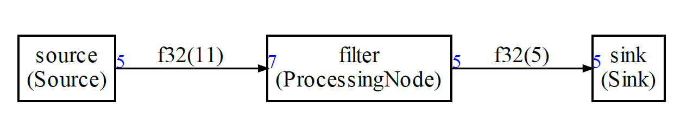
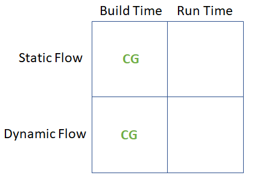

# Compute Graph for streaming with CMSIS-DSP

## Introduction

Embedded systems are often used to implement streaming solutions : the software is processing and / or generating stream of samples. The software is made of components that have no concept of streams : they are working with buffers. As a consequence, implementing a streaming solution is forcing the developer to think about scheduling questions, FIFO sizing etc ...

The CMSIS-DSP compute graph is a **low overhead** solution to this problem : it makes it easier to build streaming solutions by connecting components and computing a scheduling at **build time**. The use of C++ template also enables the compiler to have more information about the components for better code generation.

A dataflow graph is a representation of how compute blocks are connected to implement a streaming processing. 

Here is an example with 3 nodes:

- A source
- A filter
- A sink

Each node is producing and consuming some amount of samples. For instance, the source node is producing 5 samples each time it is run. The filter node is consuming 7 samples each time it is run.

The FIFOs lengths are represented on each edge of the graph : 11 samples for the leftmost FIFO and 5 for the other one.

In blue, the amount of samples generated or consumed by a node each time it is called.



When the processing is applied to a stream of samples then the problem to solve is : 

> **how the blocks must be scheduled and the FIFOs connecting the block dimensioned**

The general problem can be very difficult. But, if some constraints are applied to the graph then some algorithms can compute a static schedule at build time.

When the following constraints are satisfied we say we have a Synchronous / Static Dataflow Graph:

- Static graph : graph topology is not changing
- Each node is always consuming and producing the same number of samples (static flow)

The CMSIS-DSP Compute Graph Tools are a set of Python scripts and C++ classes with following features:

- A compute graph and its static flow can be described in Python
- The Python script will compute a static schedule and the FIFOs size
- A static schedule is:
  - A periodic sequence of functions calls
  - A periodic execution where the FIFOs remain bounded
  - A periodic execution with no deadlock : when a node is run there is enough data available to run it 
- The Python script will generate a [Graphviz](https://graphviz.org/) representation of the graph 
- The Python script will generate a C++ implementation of the static schedule 
- The Python script can also generate a Python implementation of the static schedule (for use with the CMSIS-DSP Python wrapper)

There is no FIFO underflow or overflow due to the scheduling. If there are not enough cycles to run the processing, the real-time will be broken and the solution won't work But this problem is independent from the scheduling itself. 

## Why it is useful

Without any scheduling tool for a dataflow graph, there is a problem of modularity : a change on a node may impact other nodes in the graph. For instance, if the number of samples consumed by a node is changed:

- You may need to change how many samples are produced by the predecessor blocks  in the graph (assuming it is possible)
- You may need to change how many times the predecessor blocks must run
- You may have to change the FIFOs sizes

With the CMSIS-DSP Compute Graph (CG) Tools you don't have to think about those details while you are still experimenting with your data processing pipeline. It makes it easier to experiment, add or remove blocks, change their parameters.

The tools will generate a schedule and the FIFOs. Even if you don't use this at the end for a final implementation, the information could be useful : is the schedule too long ? Are the FIFOs too big ? Is there too much latency between the sources and the sinks ?

Let's look at an (artificial) example:


Without a tool, the user would probably try to modify the number of samples so that the number of sample produced is equal to the number of samples consumed. With the CG Tools  we know that such a graph can be scheduled and that the FIFO sizes need to be 11 and 5.

The periodic schedule generated for this graph has a length of 19. It is big for such a small graph and it is because, indeed 5 and 7 are not very well chosen values. But, it is working even with those values.

The schedule is (the size of the FIFOs after the execution of the node displayed in the brackets):

```
source [ 5   0]
source [10   0]
filter [ 3   5]
sink   [ 3   0]
source [ 8   0]
filter [ 1   5]
sink   [ 1   0]
source [ 6   0]
source [11   0]
filter [ 4   5]
sink   [ 4   0]
source [ 9   0]
filter [ 2   5]
sink   [ 2   0]
source [ 7   0]
filter [ 0   5]
sink   [ 0   0]
```

At the end, both FIFOs are empty so the schedule can be run again : it is periodic !

The compute graph is focusing on the synchronous / static case but some extensions have been introduced for more flexibility:

* A [cyclo-static scheduling](CycloStatic.md) (nearly static)
* A [dynamic/asynchronous](Dynamic.md) mode

Here is a summary of the different configuration supported by the compute graph. The cyclo-static scheduling is part of the static flow mode.



## How to use the static scheduler generator

First, you must install the `CMSIS-DSP` PythonWrapper:

```
pip install cmsisdsp
```

The functions and classes inside the cmsisdsp wrapper can be used to describe and generate the schedule.

To start, you can create a `graph.py` file and include :

```python
from cmsisdsp.cg.scheduler import *
```

In this file, you can describe new type of blocks that you need in the compute graph if they are not provided by the python package by default.

Finally, you can execute `graph.py` to generate the C++ files.

The generated files need to include the `ComputeGraph/cg/src/GenericNodes.h` and the nodes used in the graph and which can be found in `cg/nodes/cpp`. Those headers are part of the CMSIS-DSP Pack. They are optional so you'll need to select the compute graph extension in the pack.

If you have declared new nodes in `graph.py` then you'll need to provide an implementation.

More details and explanations can be found in the documentation for the examples. The first example is a deep dive giving all the details about the Python and C++ sides of the tool: 

* [Example 1 : how to describe a simple graph](documentation/example1.md)
* [Example 2 : More complex example with delay and CMSIS-DSP](documentation/example2.md)
* [Example 3 : Working example with CMSIS-DSP and FFT](documentation/example3.md)
* [Example 4 : Same as example 3 but with the CMSIS-DSP Python wrapper](documentation/example4.md)
* [Example 10 : The asynchronous mode](documentation/example10.md)

Examples 5 and 6 are showing how to use the CMSIS-DSP MFCC with a synchronous data flow.

Example 7 is communicating with OpenModelica. The Modelica model (PythonTest) in the example is implementing a Larsen effect.

Example 8 is showing how to define a new custom datatype for the IOs of the nodes. Example 8 is also demonstrating a new feature where an IO can be connected up to 3 inputs and the static scheduler will automatically generate duplicate nodes.

## Frequently asked questions:

There is a [FAQ](FAQ.md) document.

## Options

Several options can be used in the Python to control the schedule generation. Some options are used by the scheduling algorithm and other options are used by the code generators or graphviz generator:

### Options for the graph

Those options needs to be used on the graph object created with `Graph()`.

For instance :

```python
g = Graph()
g.defaultFIFOClass = "FIFO"
```

#### defaultFIFOClass (default = "FIFO")

Class used for FIFO by default. Can also be customized for each connection (`connect` of `connectWithDelay` call) with something like:

`g.connect(src.o,b.i,fifoClass="FIFOClassNameForThisConnection")`

#### duplicateNodeClassName(default="Duplicate")

Prefix used to generate the duplicate node classes like `Duplicate2`, `Duplicate3` ...

### Options for the scheduling

Those options needs to be used on a configuration objects passed as argument of the scheduling function. For instance:

```python
conf = Configuration()
conf.debugLimit = 10
sched = g.computeSchedule(config = conf)
```

Note that the configuration object also contain options for the code generators.

#### memoryOptimization (default = False)

When the amount of data written to a FIFO and read from the FIFO is the same, the FIFO is just an array. In this case, depending on the scheduling, the memory used by different arrays may be reused if those arrays are not needed at the same time.

This option is enabling an analysis to optimize the memory usage by merging some buffers when it is possible.

#### sinkPriority (default = True)

Try to prioritize the scheduling of the sinks to minimize the latency between sources and sinks.

When  this option is enabled, the tool may not be able to find a schedule in all cases. If it can't find a schedule, it will raise a `DeadLock` exception.

#### displayFIFOSizes (default = False)

During computation of the schedule, the evolution of the FIFO sizes is generated on `stdout`.

#### dumpSchedule (default = False)

During computation of the schedule, the human readable schedule is generated on `stdout`.

### Options for the code generator

#### debugLimit (default = 0)

When `debugLimit` is > 0, the number of iterations of the scheduling is limited to  `debugLimit`. Otherwise, the scheduling is running forever or until an error has occured.

#### dumpFIFO (default = False)

When true, generate some code to dump the FIFO content at runtime. Only useful for debug.

In C++ code generation, it is only available when using the mode `codeArray == False`.

When this mode is enabled, the first line of the scheduler file is :

`#define DEBUGSCHED 1`

and it also enable some debug code in `GenericNodes.h`

#### schedName (default = "scheduler")

Name of the scheduler function used in the generated code.

#### prefix (default = "")

Prefix to add before the FIFO buffer definitions. Those buffers are not static and are global. If you want to use several schedulers in your code, the buffer names used by each should be different.

Another possibility would be to make the buffer static by redefining the macro `CG_BEFORE_BUFFER`

#### Options for C Code Generation only

##### cOptionalArgs (default = "")

Optional arguments to pass to the C API of the scheduler function

##### codeArray (default = True)

When true, the scheduling is defined as an array. Otherwise, a list of function calls is generated.

A list of function call may be easier to read but if the schedule is long, it is not good for code size. In that case, it is better to encode the schedule as an array rather than a list of functions.

When `codeArray` is True, the option `switchCase`can also be used.

##### switchCase (default = True)

`codeArray` must be true or this option is ignored.

When the schedule is encoded as an array, it can either be an array of function pointers (`switchCase` false) or an array of indexes for a state machine (`switchCase` true)

##### eventRecorder (default = False)

Enable the generation of `CMSIS EventRecorder` intrumentation in the code. The CMSIS-DSP Pack is providing definition of 3 events:

* Schedule iteration
* Node execution
* Error

##### customCName (default = "custom.h")

Name of custom header in generated C code. If you use several scheduler, you may want to use different headers for each one.

##### postCustomCName (default = "")

Name of custom header in generated C code coming after all of the other includes. 

##### genericNodeCName (default = "GenericNodes.h")

Name of GenericNodes header in generated C code. If you use several scheduler, you may want to use different headers for each one.

##### appNodesCName (default = "AppNodes.h")

Name of AppNodes header in generated C code. If you use several scheduler, you may want to use different headers for each one.

##### schedulerCFileName (default = "scheduler")

Name of scheduler cpp and header in generated C code. If you use several scheduler, you may want to use different headers for each one.

If the option is set to `xxx`, the names generated will be `xxx.cpp` and `xxx.h`

##### CAPI (default = True)

By default, the scheduler function is callable from C. When false, it is a standard C++ API.

##### CMSISDSP (default = True)

If you don't use any of the datatypes or functions of the CMSIS-DSP, you don't need to include the `arm_math.h` in the scheduler file. This option can thus be set to `False`.

##### asynchronous (default = False)

When true, the scheduling is for a dynamic / asynchronous flow. A node may not always produce or consume the same amount of data. As consequence, a scheduling can fail. Each node needs to implement a `prepareForRunning` function to identify and recover from FIFO underflows and overflows.

A synchronous schedule is used as start and should describe the average case.

This implies `codeArray` and `switchCase`. This disables `memoryOptimizations`.

Synchronous FIFOs that are just buffers will be considered as FIFOs in asynchronous mode.

More info are available in the documentation for [this mode](Dynamic.md).

##### FIFOIncrease (default 0)

In case of dynamic / asynchronous scheduling, the FIFOs may need to be bigger than what is computed assuming a static / synchronous scheduling. This option is used to increase the FIFO size. It represents a percent increase.

For instance, a value of 10 means the FIFO will have their size updated from `oldSize` to `1.1 * oldSize` which is ` (1 + 10%)* oldSize`

##### asyncDefaultSkip (default True)

Behavior of a pure function (like CMSIS-DSP) in asynchronous mode. When `True`, the execution is skipped if the function can't be executed. If `False`, an error is raised.

If another error recovery is needed, the function must be packaged into a C++ class to implement a `prepareForRun` function.

#### Options for Python code generation only

##### pyOptionalArgs (default = "")

Optional arguments to pass to the Python version of the scheduler function

##### customPythonName (default = "custom")

Name of custom header in generated Python code. If you use several scheduler, you may want to use different headers for each one.

##### appNodesPythonName (default = "appnodes")

Name of AppNodes header in generated Python code. If you use several scheduler, you may want to use different headers for each one.

##### schedulerPythonFileName (default = "sched")

Name of scheduler file in generated Python code. If you use several scheduler, you may want to use different headers for each one.

If the option is set to `xxx`, the name generated will be `xxx.py`

### Options for the graphviz generator

#### horizontal (default = True)

Horizontal or vertical layout for the graph.

#### displayFIFOBuf (default = False)

By default, the graph is displaying the FIFO sizes. If you want to know with FIFO variable is used in the code, you can set this option to true and the graph will display the FIFO variable names.

### Options for connections

It is now possible to write something like:

```python
g.connect(src.o,b.i,fifoClass="FIFOSource")
```

The `fifoClass` argument allows to choose a specific FIFO class in the generated C++ or Python.

Only the `FIFO` class is provided by default. Any new implementation must inherit from `FIFObase<T>`

## How to build the examples

In folder `ComputeGraph/example/build`, type the `cmake` command:

```bash
cmake -DHOST=YES \
   -DDOT="path to dot.EXE" \
   -DCMSISCORE="path to cmsis core include directory" \
   -G "Unix Makefiles" ..
```

The Graphviz dot tool is requiring a recent version supporting the HTML-like labels.

If cmake is successful, you can type `make` to build the examples. It will also build CMSIS-DSP for the host.

If you don't have graphviz, the option -DDOT can be removed.

If for some reason it does not work, you can go into an example folder (for instance example1), and type the commands:

```bash
python graph.py 
dot -Tpdf -o test.pdf test.dot
```

It will generate the C++ files for the schedule and a pdf representation of the graph.

Note that the Python code is relying on the CMSIS-DSP PythonWrapper which is now also containing the Python scripts for the Synchronous Data Flow.

For `example3` which is using an input file, `cmake` should have copied the input test pattern `input_example3.txt` inside the build folder. The output file will also be generated in the build folder.

`example4` is like `example3` but in pure Python and using the CMSIS-DSP Python wrapper (which must already be installed before trying the example). To run a Python example, you need to go into an example folder and type:

```bash
python main.py
```

`example7` is communicating with `OpenModelica`. You need to install the VHTModelica blocks from the [VHT-SystemModeling](https://github.com/ARM-software/VHT-SystemModeling) project on our GitHub

## Limitations

- CMSIS-DSP integration must be improved to make it easier
- The code is requiring a lot more comments and cleaning
- A C version of the code generator is missing
- The code generation could provide more flexibility for memory allocation with a choice between:
  - Global
  - Stack
  - Heap

## Default nodes
Here is a list of the nodes supported by default. More can be easily added:

- Unary:
  - Unary function with header `void function(T* src, T* dst, int nbSamples)`
- Binary:
  - Binary function with header `void function(T* srcA, T* srcB, T* dst, int nbSamples)`
- CMSIS-DSP function:
  - It will detect if it is an unary or binary function.
  - The name must not contain the prefix `arm` nor the the type suffix
  - For instance, use `Dsp("mult",CType(F32),NBSAMPLES)` to use `arm_mult_f32`
  - Other CMSIS-DSP function (with an instance variable) are requiring the creation of a Node if it is not already provided
- CFFT / ICFFT : Use of CMSIS-DSP CFFT. Currently only F32, F16 and Q15 
- Zip / Unzip : To zip / unzip streams 
- ToComplex : Map a real stream onto a complex stream
- ToReal : Extract real part of a complex stream
- FileSource and FileSink : Read/write float to/from a file (Host only)
- NullSink : Do nothing. Useful for debug 
- InterleavedStereoToMono : Interleaved stereo converted to mono with scaling to avoid saturation of the addition
- Python only nodes:
  - WavSink and WavSource to use wav files for testing
  - VHTSDF : To communicate with OpenModelica using VHTModelica blocks

