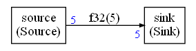
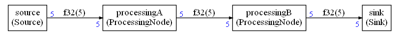
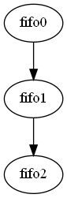
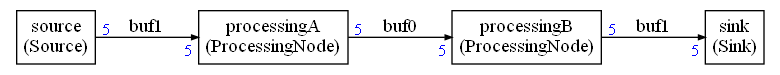
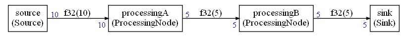
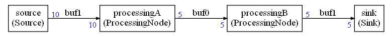

# Memory optimizations

## Buffers

Sometimes, a FIFO is in fact a buffer. In below graph, the source is writing 5 samples and the sink is reading 5 samples.



The scheduling will obviously be something like:

`Source, Sink, Source, Sink ...`

In this case, the FIFO is used as a simple buffer. The read and the write are always taking place from the start of the buffer.

The schedule generator will detect FIFOs that are used as buffer and the FIFO implementation will be replaced by buffers : the third argument of the template (`isArray`) is set to one:

```C++
FIFO<float32_t,FIFOSIZE0,1,0> fifo0(buf1);
```

## Buffer sharing

When several FIFOs are used as buffers then it may be possible to share the underlying memory for all of those buffers. This optimization is enabled by setting `memoryOptimization` to `true` in the configuration object:

```python
conf.memoryOptimization=True
```

The optimization depends on how the graph has been scheduled.

With the following graph there is a possibility for buffer sharing:



Without `memoryOptimization`, the FIFO are consuming 60 bytes (4*5 * 3 FIFOs). With `memoryOptimization`, only 40 bytes are needed.

You cannot share memory for the input / output of a node since a node needs both to read and write for its execution. This imposes some constraints on the graph.

The constraints are internally represented by a different graph that represents when buffers are live at the same time : the interference graph. The input / output buffers of a node are live at the same time. Graph coloring is used to identify, from this graph of interferences, when memory for buffers can be shared. 

The interference graph is highly depend on how the compute graph is scheduled : a buffer is live when a write has taken place but no read has yet read the full content.

For the above compute graph and its computed schedule, the interference graph would be:




Adjacent vertices in the graph should use different colors. A coloring of this graph is equivalent to assigning memory areas. Graph coloring of the previous interference graph is giving the following buffer sharing:



The dimension of the buffer is the maximum for all the edges using this buffers.

In the C++ code it is represented as:

```C++
#define BUFFERSIZE0 20
CG_BEFORE_BUFFER
uint8_t buf0[BUFFERSIZE0]={0};
```

`uint8_t` is used (instead of the `float32_t` of this example) because different edges of the graph may use different datatypes.

It is really important that you use the macro `CG_BEFORE_BUFFER` to align this buffer so that the alignment is coherent with the datatype used on all the FIFOs.

### Shared buffer sizing

Let's look at a more complex example to see how the size of the shared buffer is computed:



The source is generating 10 samples instead of 5. The FIFOs are using 80 bytes without buffer sharing.

With buffer sharing, 60 bytes are used. The buffer sharing is:



Buffer 1 is used by first and last edge in the graph. The dimension of this buffer is 40 bytes : big enough to be usable by edge 0 and edge 3 in the graph.