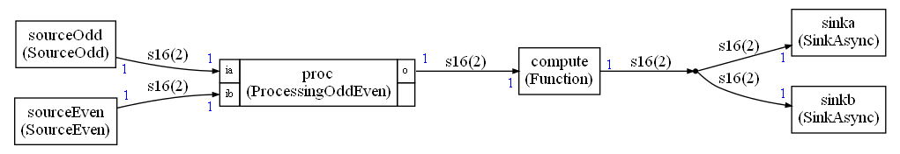

# Example 10

This example is implementing a dynamic / asynchronous mode.

It is enabled in `graph.py` with:

`conf.asynchronous = True`

The FIFO sizes are doubled with:

`conf.FIFOIncrease = 100`

The graph implemented in this example is:

There is a global iteration count corresponding to one execution of the schedule.

The odd source is generating a value only when the count is odd.

The even source is generating a value only when the count is even.

The processing is adding its inputs. If no data is available on an input, 0 is used.

In case of fifo overflow or underflow, any node will slip its execution.

All nodes are generating or consuming one sample but the FIFOs have a size of 2 because of the 100% increase requested in the configuration settings.