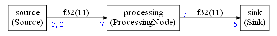

# README

This example is inside the folder `examples/cyclo` of the Compute graph folder. Before reading this documentation you need to understand the principles explained in the [simple example without CMSIS-DSP](../simple/README.md)




The nodes are:

* A source generating floating point values (0,1,2,3,4).
* A processing node adding 1 to those values 
* A sink printing its input values (1,2,3,4,5)

The graph generates an infinite streams of values : 1,2,3,4,5,1,2,3,4,5,1,2,3,4,5 ... For this example, the number of iterations will be limited so that it does not run forever.

The big difference compared to the  [simple example without CMSIS-DSP](../simple/README.md) is the source node:

* The source node is no more generating samples per packet of 5
* The first call to the source node will generate 3 samples
* The second call to the source node will generate 2 samples
* Other execution will just reproduce this schedule : 3,2,3,2 ...

The flow is not static, but it is periodically static  : **cyclo-static scheduling**.

## C++ Implementation

The C++ wrapper must take into account this periodic schedule of sample generation.

First call should generate only 3 samples and second call generate 2.

We want the first call to generate `0,1,2` and the second call to generate `3,4`.

The C++ wrapper has been modified for this. Here is the body of the `run` function:

```C++
OUT *b=this->getWriteBuffer(getSamplesForPeriod());

printf("Source\n");
for(int i=0;i<getSamplesForPeriod();i++)
{
    b[i] = mValuePeriodStart + (OUT)i;
}
updatePeriod();
```

The `run` function is generating only the number of samples required in a given period.

The value generated is using `mValuePeriodStart`.

The template for `Source` has not changed and is :

```C++
template<typename OUT,int outputSize>
class Source: public GenericSource<OUT,outputSize>
```

`outputSize` cannot be the list `[3,2]`.

The generated code is using the max of the values, so here `3`:

```C++
Source<float32_t,3> source(fifo0);
```

## Expected output:

```
Schedule length = 26
Memory usage 88 bytes
```

The schedule length is `26` compared to `19` for the simple example where source is generating samples by packet of 5. The source node executions must be a multiple of 2 in this graph because the period of sample generation has length 2. In the original graph, the number of executions could be an odd number. That's why there are more executions in this cyclo-static scheduling.

The memory usage (FIFO) is the same as the one for the simple example without cyclo-static scheduling.

The expected output of the execution is still 1,2,3,4,5,1,2,3,4,5 ... but the scheduling is different. There are more source executions.

```
Start
Source
Source
Source
ProcessingNode
Sink
1
2
3
4
5
Source
Source
Source
ProcessingNode
Sink
1
2
3
4
5
Source
Source
Source
ProcessingNode
Sink
1
2
3
4
5
Sink
1
2
3
4
5
Source
Source
ProcessingNode
Sink
1
2
3
4
5
Source
Source
Source
ProcessingNode
Sink
1
2
3
4
5
Sink
1
2
3
4
5
```

