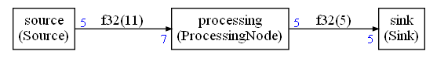

# Example 1

Please refer to the [simple example](../simple/README.md) to have an overview of how to define a graph and it nodes and how to generate the C++ code for the static scheduler. This document is only explaining additional details:

* How to define new arguments for the C implementation of the nodes
* How to define new arguments for the C API of the scheduler function
* Detailed description of the generated C++ scheduler

The graph is is nearly the same as the one in the  [simple example](../simple/README.md) but the processing node is just generating 5 samples in this example:



Contrary to the  [simple example](../simple/README.md) , there is only one Python script `graph.py` and it is containing everything : nodes, graph description and C++ code generation.

## Defining new arguments for a node and the scheduler

For `ProcessingNode`, we are adding additional arguments in this example to show how it is possible to do it for initializing a node in the generated code. 

If `processing` is the node, we can add arguments with the APIs `addLiteralArg` and `addVariableArg`.

```python
processing.addLiteralArg(4,"testString")
processing.addVariableArg("someVariable")
```

* `addLiteralArg(4,"testString")` will pass the value `4` as first additional argument of the C++ constructor (after the FIFOs) and the string `"testString"` as second additional argument of the C++ constructor (after the FIFOs)
* `addVariableArg("someVariable")` will pass the variable `someVariable` as third additional argument of the C++ constructor (after the FIFOs)

The constructor API will look like:

```C++
ProcessingNode(FIFOBase<IN> &src,FIFOBase<OUT> &dst,int,const char*,int)
```

This API is defined in `AppNodes.h` by the developper. The types are not generated by the scripts. Here the variable `someVariable` is chosen to have type `int` hence the last argument of the constructor has type `int`. But it is not imposed by the Python script that is just declaring the existence of a variable.

In the generated scheduler, the constructor is used as:

```C++
ProcessingNode<float32_t,7,float32_t,5> processing(fifo0,fifo1,4,"testString",someVariable);
```

This variable `someVariable` must come from somewhere. The API of the scheduler is:

```C++
extern uint32_t scheduler(int *error,int someVariable);
```

This new argument to the scheduler is defined in the Python script:

```python
conf.cOptionalArgs=["int someVariable"]
```

## The C++ code

The C++ code generated in`scheduler.cpp` and `scheduler.h` in `generated` folder

### scheduler.cpp

#### Included headers 

The generated code is first including the needed headers:

```C++
#include "arm_math.h"
#include "custom.h"
#include "GenericNodes.h"
#include "AppNodes.h"
#include "scheduler.h"
```

- CMSIS-DSP header
- Custom definitions
- Generic nodes from `GenericNodes.h`
- Application nodes
- scheduler API

#### Macros

The generated code is then including some macro definitions that can all be redefined to customize some aspects of the generated scheduler. By default those macros, except `CHECKERROR`, are doing nothing:

* CHECKERROR
  * Check for an error after each node executioin. Default action is to branch out of the scheduler loop and return an error
* CG_BEFORE_ITERATION
  * Code to execute before each iteration of the scheduler
* CG_AFTER_ITERATION
  * Code to executed after each iteration of the scheduler
* CG_BEFORE_SCHEDULE
  * Code to execute before starting the scheduler loop
* CG_AFTER_SCHEDULE
  * Code to execute after the end of the scheduler loop
* CG_BEFORE_BUFFER
  * Code before any buffer definition. Can be used, for instance, to align a buffer or to put this buffer in a specific memory section
* CG_BEFORE_FIFO_BUFFERS
  * Code included before the definitions of the globals FIFO buffers 
* CG_BEFORE_FIFO_INIT
  * Code to execute before the creation of the FIFO C++ objects
* CG_BEFORE_NODE_INIT
  * Code to execute before the creation of the node C++ objects
* CG_AFTER_INCLUDES
  * Code coming after the include files (useful to add other include files after the default ones)
* CG_BEFORE_SCHEDULER_FUNCTION
  * Code defined before the scheduler function
* CG_BEFORE_NODE_EXECUTION
  * Code executed before a node execution
* CG_AFTER_NODE_EXECUTION
  * Code executed after a node execution and before the error checking

#### Memory buffers and FIFOs

Then, the generated code is defining the buffers for the FIFOs. First the size are defined:

```C++
CG_BEFORE_FIFO_BUFFERS
/***********

FIFO buffers

************/
#define FIFOSIZE0 11
#define FIFOSIZE1 5
```

The FIFOs may have size different from the buffer when a buffer is shared between different FIFOs. So, there are different defines for the buffer sizes:

```C++
#define BUFFERSIZE1 11
CG_BEFORE_BUFFER
float32_t buf1[BUFFERSIZE1]={0};

#define BUFFERSIZE2 5
CG_BEFORE_BUFFER
float32_t buf2[BUFFERSIZE2]={0};
```

In case of buffer sharing, a shared buffer will be defined with `int8_t` type. It is **very important** to align such a buffer by defining `CG_BEFORE_BUFFER` See the [FAQ](../../FAQ.md) for more information about alignment issues.

#### Description of the schedule

```C++
static unsigned int schedule[17]=
{ 
2,2,0,1,2,0,1,2,2,0,1,2,0,1,2,0,1,
};
```

There are different code generation modes in the compute graph. By default, the schedule is encoded as a list of numbers and a `switch/case` is used to execute the node corresponding to an identification number.

#### Scheduler API

Then, the scheduling function is generated:

```C++
uint32_t scheduler(int *error,int someVariable) {
```

A value `<0` in `error` means there was an error during the execution.

The returned valued is the number of schedules fully executed when the error occurred.

The `someVariable` is defined in the Python script. The Python script can add as many arguments as needed with whatever type is needed.

#### Scheduler locals

The scheduling function is starting with a definition of some variables used for debug and statistics:

```C++
int cgStaticError=0;
uint32_t nbSchedule=0;
int32_t debugCounter=1;
```

Then, it is followed with a definition of the FIFOs:

```C++
CG_BEFORE_FIFO_INIT;
/*
Create FIFOs objects
*/
FIFO<float32_t,FIFOSIZE0,0,0> fifo0(buf1);
FIFO<float32_t,FIFOSIZE1,1,0> fifo1(buf2);
```

The FIFO template has type:

```C++
template<typename T, int length, int isArray=0, int isAsync = 0>
class FIFO;
```

`isArray` is set to `1` when the Python code can deduce that the FIFO is always used as an array. In this case, the memory buffer may be shared with other FIFO depending on the data flow dependencies of the graph.

`isAsync` is set to 1 when the graph is an asynchronous one.

Then, the nodes are created and connected to the FIFOs:

```C++
/* 
Create node objects
*/
ProcessingNode<float32_t,7,float32_t,5> processing(fifo0,fifo1,4,"testString",someVariable);
Sink<float32_t,5> sink(fifo1);
Source<float32_t,5> source(fifo0);
```

And finally, the function is entering the scheduling loop:

```C++
 /* Run several schedule iterations */
    CG_BEFORE_SCHEDULE;
    while((cgStaticError==0) && (debugCounter > 0))
    {
```

The content of the loop is a `switch / case`:

```C++
CG_BEFORE_NODE_EXECUTION;

switch(schedule[id])
{
    case 0:
    {
        cgStaticError = processing.run();
    }
    break;

    case 1:
    {
        cgStaticError = sink.run();
    }
    break;

    case 2:
    {
        cgStaticError = source.run();
    }
    break;

    default:
    break;
}
CG_AFTER_NODE_EXECUTION;
CHECKERROR;
```

#### Error handling

In case of error, the code is branching out to the end of the function:

```C++
errorHandling:
    CG_AFTER_SCHEDULE;
    *error=cgStaticError;
    return(nbSchedule);
```

## Expected output

Output of the Python script:

```
Schedule length = 17
Memory usage 64 bytes
```

Output of the execution:

```
Start
Source
Source
ProcessingNode
Sink
3
0
0
0
0
Source
ProcessingNode
Sink
10
0
0
0
0
Source
Source
ProcessingNode
Sink
17
0
0
0
0
Source
ProcessingNode
Sink
24
0
0
0
0
Source
ProcessingNode
Sink
31
0
0
0
0
```

The source is incrementing a counter and generate 0,1,2,3 ...

The processing node is copying the 4th sample of the input to the first sample of the output. So there is a delta of 7 between each new value written to the output.

The sink is displaying the 5 samples at the input.
