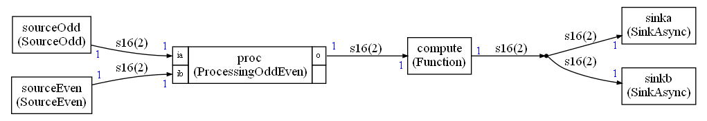

# Example 10

Please refer to the [simple example](../simple/README.md) to have an overview of how to define a graph and it nodes and how to generate the C++ code for the static scheduler. This document is only explaining additional details

This example is implementing a [dynamic / asynchronous mode](../../Async.md).

It is enabled in `graph.py` with:

`conf.asynchronous = True`

There is an option to increase the FIFO size compared to their synchronous values. To double the value (increase by `100%`) we write:

`conf.FIFOIncrease = 100`

The graph implemented in this example is:



There is a global iteration count corresponding to one execution of the schedule.

The odd source is generating a value only when the count is odd.

The even source is generating a value only when the count is even.

The processing is adding its inputs. If no data is available on an input, 0 is used.

In case of FIFO overflow or underflow, any node will skip its execution.

All nodes are generating or consuming one sample but the FIFOs have a size of 2 because of the 100% increase requested in the configuration settings.

Thus in this example :

* A sample is not always generated on an edge
* A sample is not always available on an edge

The dataflow on each edge is thus not static and vary between iterations of the schedule

## Expected outputs

```
Schedule length = 9
Memory usage 34 bytes
```

```
Start
0
0
1
1
2
2
3
3
4
4
5
5
6
6
7
7
8
8
9
9
```

