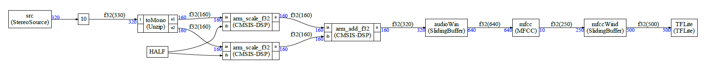

# Example 2

Please refer to the [simple example](../simple/README.md) to have an overview of how to define a graph and it nodes and how to generate the C++ code for the static scheduler. 

The [simple example with CMSIS-DSP](../simpledsp/README.md) is giving more details about `Constant` nodes and CMSIS-DSP functions in the compute graph.

In this example. we are just analyzing a much more complex example to see some new features:

- Delay
- SlidingBuffer

This example is not really using a MFCC or a TensorFlow Lite node. It is just providing some wrappers to show how such a nodes could be included in a graph:

The graph is:



It is much more complex:

- First we have a stereo source delayed by 10 samples ;
- Then this stereo source is split into left/right samples using the default block Unzip 
- The samples are divided by 2 using a CMSIS-DSP function
- The node HALF representing a constant is introduced (constant arrays are also supported)
- The two streams are added using a CMSIS-DSP function
- Then we have a sliding buffer 
- A block representing a MFCC (a fake MFCC)
- Another sliding buffer
- An a block representing TensorFlow Lite for Micro (a fake TFLite node)

Note that those blocks (MFCC, TFLite) are doing nothing in this example. It is just to illustrate a more complex example typical of keyword spotting applications.

Examples 5 and 6 are showing how to use the CMSIS-DSP MFCC.

Let's look at the new features compared to example 1:

## Delay

```python
g.connectWithDelay(src.o, toMono.i,10)
```

To add a delay on a link between 2 nodes, you just use the `connectWithDelay` function. Delays can be useful for some graphs which are not schedulable. They are implemented by starting the schedule with a FIFO which is not empty but contain some 0 samples.

## CMSIS-DSP function

Some CMSIS-DSP functions are automatically made available to the framework : mainly the functions with no state and which are pure stream based computation : Basic math functions etc ...

To create a CMSIS-DSP node, just use:

```python
sa=Dsp("scale",floatType,blockSize)
```

The corresponding CMSIS-DSP function will be named: `arm_scale_f32`

The code generated in `scheduler.cpp` will not require any C++ class, It will look like:

```C++
{
    float32_t* i0;
    float32_t* i1;
    float32_t* o2;
    i0=fifo3.getReadBuffer(160);
    i1=fifo4.getReadBuffer(160);
    o2=fifo5.getWriteBuffer(160);
    arm_add_f32(i0,i1,o2,160);
    cgStaticError = 0;
}
```


## Constant node 

In the case of scaling, we need to connect the scaling factor to the node. So we need a constant node. 

A constant node is defined as:

```python
half=Constant("HALF")
```

In the C++ code, `HALF` is expected to be a value defined in `custom.h`

Constant values are not involved in the scheduling (they are ignored) and they have no IO. So, to connect to a constant node we do:

```python
g.connect(half,sa.ib)
```

There is no "o", "oa" suffixes for the constant node `half`.

Constant nodes are just here to make it easier to use CMSIS-DSP functions.

## SlidingBuffer 

Sliding buffers and OverlapAndAdd are used  a lot so they are provided in the `cg/nodes/cpp`folder of the `ComputeGraph` folder.

In Python, it can be used with:

```python
audioWindow=SlidingBuffer("audioWin",floatType,640,320)
```

The first length (`640`) is the window size and the second length (`320`) is the overlap. So, in this case we have an overlap of 50%

There is no C++ class to write for this since it is provided by default by the framework.

It is named `SlidingBuffer` but not `SlidingWindow` because no multiplication with a window is done. It must be implemented with another block as will be demonstrated in the [example 3](example3.md)

## Expected outputs

```
Schedule length = 302
Memory usage 10720 bytes
```

And when executed:

```
Start
Nb = 40
```

Execution is running for 40 iterations without errors.
