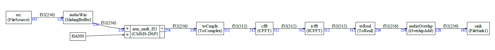
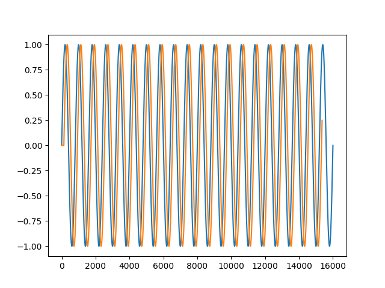

# Example 3

Please refer to the [simple example](../simple/README.md) to have an overview of how to define a graph and it nodes and how to generate the C++ code for the static scheduler. This document is only explaining additional details

This example is implementing a working example with FFT. The graph is:



The example is:

- Providing a file source which is reading a source file and then padding with zero 
- A sliding window 
- A multiplication with a Hann window 
- A conversion to/from complex
- Use of CMSIS-DSP FFT/IFFT 
- Overlap and add 
- File sink writing the result into a file 

The new feature s compared to previous examples are:

- The constant array HANN 
- The CMSIS-DSP FFT 

## Constant array

It is like in example 2 where the constant was a float.

Now, the constant is an array:

```python
hann=Constant("HANN")
```

In `custom.h`, this array is defined as:

```C++
extern const float32_t HANN[256];
```


## CMSIS-DSP FFT

The FFT node cannot be created using a `Dsp` node in Python because FFT is requiring specific initializations. So, a Python class and C++ class must be created. They are provided by default in the ffamework butg let's look at how they are implemented:

```python
class CFFT(GenericNode):
    def __init__(self,name,theType,inLength):
        GenericNode.__init__(self,name)

        self.addInput("i",theType,2*inLength)
        self.addOutput("o",theType,2*inLength)

    @property
    def typeName(self):
        return "CFFT"
```

Look at the definition of the inputs and outputs : The FFT is using complex number so the ports have twice the number of float samples. The argument of the constructor is the FFT length in **complex** sample but `addInput` and `addOutput` require the number of samples of the base type : here float.

We suggest to use as arguments of the blocks a number of samples which is meaningful for the blocks and use the lengths in standard data type (f32, q31 ...) when defining the IO.

So here, the number of complex samples is used as arguments. But the IO are using the number of floats required to encode those complex numbers hence a factor of 2.

The C++ template is:

```C++
template<typename IN, int inputSize,typename OUT,int outputSize>
class CFFT;
```

There are only specific implementations for specific datatype. No generic implementation is provided.

For, float we have:

```C++
template<int inputSize>
class CFFT<float32_t,inputSize,float32_t,inputSize>: public GenericNode<float32_t,inputSize,float32_t,inputSize>
{
public:
    CFFT(FIFOBase<float32_t> &src,FIFOBase<float32_t> &dst):GenericNode<float32_t,inputSize,float32_t,inputSize>(src,dst)
    {
         arm_status status;
         status=arm_cfft_init_f32(&sfft,inputSize>>1);
    };

    int prepareForRunning() override
    {
        if (this->willOverflow() ||
            this->willUnderflow())
        {
           return(CG_SKIP_EXECUTION_ID_CODE); // Skip execution
        }

        return(0);
    };

    int run() override
    {
        float32_t *a=this->getReadBuffer();
        float32_t *b=this->getWriteBuffer();
        memcpy((void*)b,(void*)a,inputSize*sizeof(float32_t));
        arm_cfft_f32(&sfft,b,0,1);
        return(0);
    };

    arm_cfft_instance_f32 sfft;

};
```

It is verbose but not difficult. The constructor is initializing the CMSIS-DSP FFT instance and connecting to the FIFO (through GenericNode).

The run function is applying the `arm_cfft_f32`. Since this function is modifying the input buffer, there is a `memcpy`. It is not really needed here. The read buffer can be modified by the CFFT. It will just make it more difficult to debug if you'd like to inspect the content of the FIFOs.

THe function `prepareForRunning` is only used in asynchronous mode. Please refer to the documentation for the asynchronous mode.

This node is provided in `cg/nodes/cpp` so no need to define it. You can just use it by including the right headers.

It can be used by just doing in your `AppNodes.h` file :

```c++
#include "CFFT.h"
```

From Python side it would be:

```python
from cmsisdsp.cg.scheduler import *
```

The scheduler module is automatically including the default nodes.

## Expected output

Output of Python script:

```
Schedule length = 25
Memory usage 11264 bytes
```

Output of execution:

```
Start
Nb = 40
```

It is running for 40 iterations of the scheduler without errors.

The python script `debug.py` can be used to display the content of `input_example3.txt` and `../build/output_example3.txt`

It should display the same sinusoid but it is delayed in `output_example3.txt` by a few samples because of the sliding buffer. The sliding buffer will generate 256 samples in output each time 128 samples are received in input. As consequence, at start, 256 samples with the half set to zero are generated.

We can check it in the debug script by comparing a delayed version of the original to the output.

You should get something like:



We have 40 execution of the schedule iteration. In each schedule iteration we have two sinks. A sink is producing 192 samples. 

So, the execution is producing `40 * 2 * 192 == 15360` so a bit less than the `16000` samples in input. 

If we compare the input and output taking into account this length difference and the delay of 128 samples, we get (by running `debug.py`):

```
Comparison of input and output : max absolute error
6.59404862823898e-07
```

