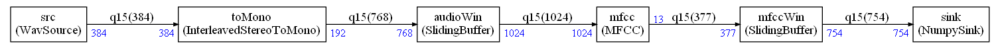
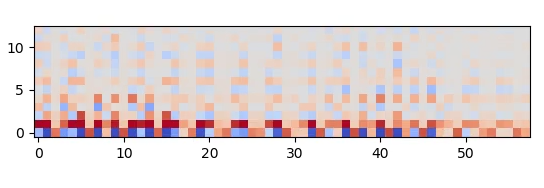

# Example 5

This is a pure python example. It is computing a sequence of MFCC with an overlap of 0.5 s and it is creating an animation.

It can be run with:

`python main.py`

The `NumPy` sink at the end is just recording all the MFCC outputs as a list of buffers. This list is used to create an animation.



## Expected output

```
Generate graphviz and code
Schedule length = 292
Memory usage 6614 bytes
```

And when executed you should get an animation looking like this:



The Python `main.py` contains a line which can be uncommented to record the animation as a `.mp4` video.