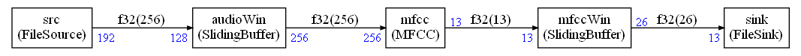

# Example 6

This example is similar to example 5 but with C code generation instead of Python.



## Expected output

```
nbMFCCOutputs = 126
Generate graphviz and code
Schedule length = 17
Memory usage 2204 bytes
```

