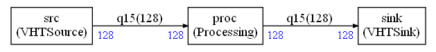
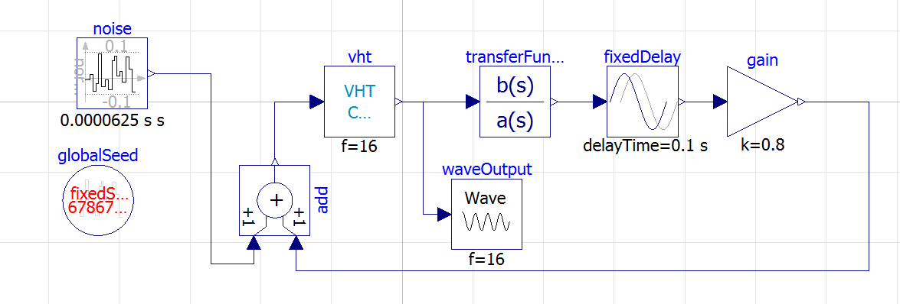
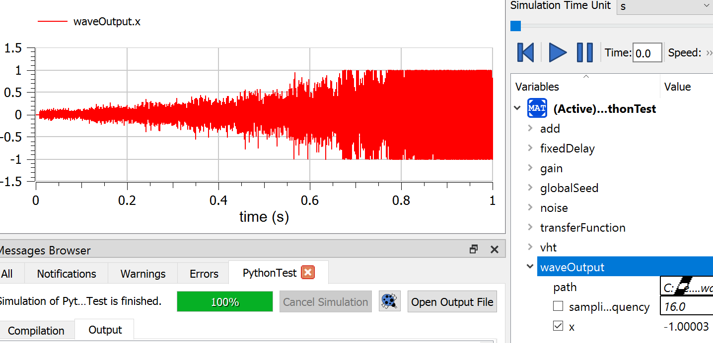

# Example 7

This is an example showing how a graph in in Python (not C) can interact with an [OpenModelica](https://openmodelica.org/) model.



First you need to get the project [AVH-SystemModeling](https://github.com/ARM-software/AVH-SystemModeling) from our ARM-Software repository.

Then, you need  launch `OpenModelica` and choose `Open Model`. 

Select `AVH-SystemModeling/VHTModelicaBlock/ARM/package.mo`

Then choose `Open Model` again and select `PythonTest.mo`.

You should see something like that in `Open Modelica`:



Customize the output path in the `Wave` node.

Refer to the `Open Modelica` documentation to know who to build and run this simulation. Once it is started in Modelica, launch the Python script in `example7`:

`python main.py`

You should see :

```
Connecting as INPUT
Connecting as OUTPUT
```

In Modelica window, the simulation should continue to `100%`.

In the simulation window, you should be able to plot the output wav and get something like:



A `.wav` should have been generated so that you can listen to the result : A Larsen effect !

The `Processing` node in the compute graph is implemented in `custom.py` and is a gain computed with `CMSIS-DSP` Python wrapper

```python
class Processing(GenericNode):
    def __init__(self,inputSize,outputSize,fifoin,fifoout):
        GenericNode.__init__(self,inputSize,outputSize,fifoin,fifoout)

    def run(self):

        i=self.getReadBuffer()
        o=self.getWriteBuffer()

        b=dsp.arm_scale_q15(i,0x6000,1)

        o[:]=b[:]

        return(0)
```


The gain has been chosen to create an instability.

