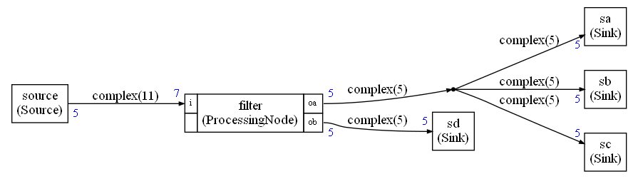

# Example 8

This example is illustrating :

* The `Duplicate` node to have a one-to-many connection at an output
* A structured datatype for the samples in the connections



## Structured datatype

It is  possible to use a custom datatype:

For the C++ version of the scheduler it would be:

```python
complexType=CStructType("MyComplex",8)
```

This is defining a new datatype that is mapped to the type `complex` in C/C++.

The last argument is the size in bytes of the struct in C.

The type complex may be defined with:

```c
typedef struct {
    float re;
    float im;
} complex;
```

For the Python version of the scheduler:

```python
complexType=PythonClassType("MyComplex")
```

The class `MyComplex` is used in Python. 


**Note that:**

- The value **must have** value semantic in C/C++. So avoid classes 
- In Python, the classes have reference semantic which implies some constraints:
  - You should never modify an object from the read buffer 
  - You should change the field of an object in the write buffer but not the object itself
  - If you need a new object : copy or create a new object. Never use an object from the read buffer as it is if you intend to customize it

The size of the C structure should take into account the padding that may be added to the struct. 

When no buffer sharing is used, the size of buffers is always expressed in number of samples.

But in case of buffer sharing, the datatype of the buffer is `int8_t` and the size of the buffer must be computed by the Compute Graph taking into account ay padding that may exist.

## Duplicate node

In case of a one-to-many connections, the Python code will automatically add `Duplicate` nodes in the graph. Those `Duplicate` nodes do not appear directly in the graphviz but only as a stylized way : a dot.

Currently it is limited to 3. If you need more that 3 outputs on an IO you'll have to insert the `Duplicate` nodes explicitly in the graph.

In the generated code, you'll see the `Duplicate` nodes. For instance, in this example:

```C++
Duplicate3<complex,5,complex,5,complex,5,complex,5> dup0(fifo2,fifo3,fifo4,fifo5);
```

