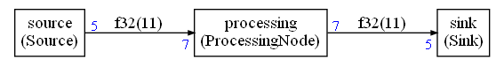

# README

This example is inside the folder `examples/simple` of the Compute graph folder.

This example explains how to create a very simple synchronous compute graph with 3 nodes:



The nodes are:

* A source generating 5 floating point values (0,1,2,3,4) each time it is run
* A processing node adding 1 to those values 
* A sink printing its input values (1,2,3,4,5)

The graph generates an infinite streams of values : 1,2,3,4,5,1,2,3,4,5,1,2,3,4,5 ... For this example, the number of iterations will be limited so that it does not run forever.

Each node is using the floating point data type for the values.

The sink and the sources are working on packets of 5 values.

The processing node is working on packets of 7 values.

## Principle of operation

The graph is described with a Python script `create.py` and this document will explain how to write this Python script to define the nodes and their connections.

When this Python script is executed, it will compute a static schedule and generate a C++ implementation. This implementation is using some C++ wrapper that must have been defined somewhere. This document will explain how to write those wrappers and make them available to the C++ scheduler.

To run the script you first must install the CMSIS-DSP Python package:

`pip install cmsisdsp`

Once the CMSIS-DSP python package has been installed, you can run the script with:

`python create.py`

This will generate the following files:

* `generated/scheduler.cpp`
* `generated/scheduler.h`
* `simple.dot` (the graphviz representation of the graph)

A graphical representation of the graph is generated in graphviz dot format. If you have graphviz installed, you can generate a `png` file representing the graph with:

`dot -Tpng -o simple.png simple.dot`

The executable can be built (as explained below) by compiling the files `scheduler.cpp` and `main.cpp`.

## How to write the Python script

Let's look at the required steps in reverse order starting first with how to generate the C++ code for the scheduler.

### Generating the C++ code and the Graphviz representation

The Python script `create.py` will generate the C++ scheduler when run. This file is assuming that the nodes and the graph have already been defined somewhere else. The first lines of this script are including the nodes and graph definitions:

```python
from nodes import * 
from graph import * 
```

For this example, we don't want the schedule to run forever which should be the case for a stream computation. The first thing the script is doing is limiting the number of schedule iterations to 1 by setting a field in the configuration object:

```python
conf = Configuration()
conf.debugLimit = 1
```

This corresponds to one iteration of the schedule but the schedule may contain several executions of the different nodes in one iteration.

This example is not using any datatype from CMSIS-DSP, so we don't need to include its header and recompile the library. We can disable the CMSIS-DSP header inclusion with:

```python
conf.CMSISDSP = False
```

Then, with all those configurations and a graph description, we are ready to compute the static schedule:

```python
scheduling = the_graph.computeSchedule(config = conf)
```

`the_graph` has been imported from another file. It is the description of the compute graph.

Once the schedule has been computed, we can print some statistics:

```python
print("Schedule length = %d" % scheduling.scheduleLength)
print("Memory usage %d bytes" % scheduling.memory)
```

The scheduling length is the number of node executions required for one scheduling iteration.

The memory usage is the space required by all the FIFOs expressed in bytes.

With this example, the output should be:

```
Schedule length = 19
Memory usage 88 bytes
```

We can see that the schedule length is a bit long for 3 nodes : 19. And it is because the sink / source are processing packets of 5 samples and the processing node is processing packets of 7 samples. So, a scheduling iteration will require several executions of the different nodes in order to implement a periodic scheduling that can be iterated to process the whole stream.

We can see in the picture of the graph that the connections between the nodes are requiring 11 samples.

That's why we have 88 bytes of memory used. Each sample is 4 byte long (a float):


Now that we have computed the scheduling, we are ready to generate the C++ implementation:

```python
scheduling.ccode("generated",conf)
```

`"generated" ` is the name of the folder where the files are generated (relative to the working directory of the script). It is possible to customize the naming of the generated files using the `Configuration` object `conf` .

We can also generated a `graphviz` file that can then be processed with the `dot` tool to generate a picture of the graph:

```python
with open("simple.dot","w") as f:
    scheduling.graphviz(f)
```

Those lines are creating a `"simple.dot"` file from the graph **and** the computed schedule. The computed schedule is used to display the length of the connections between the nodes.

### Describing the graph

Now that we know how to compute a schedule and generate a C++ implementation, let's see how to describe the graph.

The file `graph.py` is containing the Python code to describe the graph. The first lines of the script are loading the node definitions and some standard definitions from the CMSIS-DSP Python wrapper :

```python
from cmsisdsp.cg.scheduler import *
from nodes import * 
```

We need the definitions from the CMSIS-DSP Python wrapper to define the datatypes used by the nodes. By default only basic datatypes are provided : float32, int16 ... It is also possible to define a C struct datatype.

```python
floatType = CType(F32)
```

#### How to instantiate the nodes

The nodes are created like any other Python object. The API is not standardized. The compute graph should be able to work with any library of standard components. In this example, the node APIs are first listing the input, then the outputs. And for each IO, we define the data type and the number of samples produced or consumed.

##### How to instantiate the source:

```python
src = Source("source",floatType,5)
```

A Python object `src` is created from the Python class `Source`. In the generated code, and in the pictures of the graph, this node will be named "source". This name must thus be a valid C variable name.

The datatype is the second argument of the constructor. It is the float datatype we defined just before. The last argument is the number of sample produced by the node at each execution : 5 samples.

##### How to instantiate the processing node:

```python
processing = ProcessingNode("processing",floatType,7,7)
```

It is very similar to the source. We just need to specify two sizes : the number of samples consumed and number of samples produced. This node is using the same data type for both input and output.

As we will see later, the C++ implementation of the node is only supporting the case where the number of samples produced is equal to the number of samples consumed. If it is not the case, the solution won't build. It is caught at the type system level. This constraint could have been enforced at the Python level.

It demonstrates that a Python description of a node can be very generic and anticipate on future use cases without introducing problem at runtime since some validation is occurring on the C++ side.

##### How to instantiate the sink:

```python
sink = Sink("sink",floatType,5)
```

It is very similar to the source.

#### How to connect the nodes:

Now that we have defined the nodes, they need to be connected to create a graph. First a `Graph` object must be created:

```python
the_graph = Graph()
```

This `Graph` class is defined in `cmsisdsp.cg.scheduler`

Now we can connect the nodes:

```python
the_graph.connect(src.o,processing.i)
the_graph.connect(processing.o,sink.i)
```

The properties `i` and `o` of the nodes have been created during description of the nodes. It is not imposed by the framework. The input / output can be named as you want if they do not conflict with existing properties of the Python objects.

### Describing the nodes

Let's now detail how to create the nodes. Those descriptions can be seen as a datatype for a node. They define:

* The number of IOs
* The datatype used for each IO
* The number of samples produced or consumed on each IO

The script `nodes.py` is defining the nodes needed for this example. The first line is importing some definitions from the CMSIS-DSP Python wrapper:

```python
from cmsisdsp.cg.scheduler import GenericNode,GenericSink,GenericSource
```

#### The source

The source is defined with:

```python
class Source(GenericSource):
    def __init__(self,name,theType,outLength):
        GenericSource.__init__(self,name)
        self.addOutput("o",theType,outLength)

    @property
    def typeName(self):
        return "Source"
```

It is a lot but it is not complex. Let's detail each part of this definition:

```python
class Source(GenericSource):
```

The `Source` class is inheriting from the `GenericSource` class. CMSIS-DSP Python Wrapper is defining `GenericSource`, `GenericSink` and `GenericNode`.

Then, we define the constructor of this class:

```python
def __init__(self,name,theType,outLength):
        GenericSource.__init__(self,name)
        self.addOutput("o",theType,outLength)
```

The constructor is first initializing the super class `GenericSource`. Then, it is defining the input or output. In a `GenericSource` we only have access to the `addOutput` function.

This function is taking three arguments:

* First argument : the name `name` of the IO. It will become a property of the object and then can be used like any other Python property 
* The type `theType` of the IO. In our example it is the `floatType` passed in argument of the constructor
* The number of samples `outLength` produced on this IO

As we can see : the API is defined by the constructor `__init__` So the API is not enforced by the compute graph. The developer of the nodes can choose whatever API is the best for a given use case

There is a last part in the definition of the node:

```python
@property
    def typeName(self):
        return "Source"
```

This defines the name of the C++ wrapper implementing the node.

#### The processing node

The processing node is defined in the same way but with input and outputs:

```python
class ProcessingNode(GenericNode):
    def __init__(self,name,theType,inLength,outLength):
        GenericNode.__init__(self,name)
        self.addInput("i",theType,inLength)
        self.addOutput("o",theType,outLength)

    @property
    def typeName(self):
        return "ProcessingNode"
```


#### The sink

```python
class Sink(GenericSink):
    def __init__(self,name,theType,inLength):
        GenericSink.__init__(self,name)
        self.addInput("i",theType,inLength)

    @property
    def typeName(self):
        return "Sink"
```


## How to write the C++ nodes

For each node datatype defined in the Python side, we need to provide an implementation on the C++ side.

The C++ class templates that we will define are just wrappers around algorithms. In this example, since the algorithms are very simple, they have been implemented directly in the wrappers. It does not have to be the case for a more complex algorithms. The C++ template are serving the same purposes as the Python definitions : defining the datatype of a node.

* The number of IOs
* Their datatype
* The number of samples consumed or produced on each IO

The C++ template is also providing some entry points to enable the scheduler to do its works :

* Access to the FIFOs
* Running the code

Those C++ templates should thus be very light and that's why we prefer to speak of C++ wrappers rather than C++ objects. The code for the algorithms will generally be outside of those wrappers (and will often be in C).

Those templates are defined in a file `AppNodes.h` included by the scheduler (it is possible to change the name from the Python script). This file must be provided by the user of the ComputeGraph framework.

### The C++ wrapper for Source

First, like with Python, we need to define the datatype:

* Number of IOs
* Their type
* The number of samples

It is done through arguments of C++ templates.

```C++
template<typename OUT,int outputSize>
class Source;
```

The previous line is defining a new class template with two arguments:

* A datatype `OUT`
* The number of samples `outputSize`

This template can be used to implement different kind of `Source` classes : with different datatypes or number of samples. We can also (when it makes sense) define a `Source` implementation that can work with any datatype and any number of samples.

You don't need to be knowledgeable in C++ template to start using them in the context of the compute graph. They are just here to define the plumbing.

The only thing to understand is that:

* `Source<X,Y>` is the datatype where the template argument has been replaced by the types `X` and `Y`. 
* `Source<X,Y>` is a different datatype than `Source<X',Y'>` if `X` and `X'` are for instance different types
* `X` and `Y` may be numbers (so a number is considered as a type in this context)

When you have declared a C++ template, you need to implement it. There are two ways to do it:

* You can define a generic implementation for `Source`
* And/or you can define specialized implementations for specific types (`Source<X,Y>`).

For the `Source` we have defined a generic implementation so we need (like in Python case) to inherit from `GenericSource`:

```C++
template<typename OUT,int outputSize>
class Source: GenericSource<OUT,outputSize>
```

Then, like in the Python case, we need to define a constructor. But contrary to the Python case, here we are defining an implementation. The constructor is not defining the IOs. The IOs are coming from the `GenericSource` template and its arguments.

```C++
public:
    Source(FIFOBase<OUT> &dst):public GenericSource<OUT,outputSize>(dst){};
```

Our `Source` has only one IO : the output. It needs the FIFO for this output. The first argument, `dst`, of  the `Source` constructor is the FIFO. This FIFO is coming from the scheduler.

We also need to initialize the `GenericSource` parent since we are inheriting from it. `GenericSource` constructor is called with the `FIFO` argument `dst`.

The constructor is here doing nothing more than initializing the parent and the implementation is empty `{}`

The implementation of `Source` needs to provide an entry point to be usable from the scheduler. It is the `run` function. As said before, since the algorithm is very simple it has been implemented in `run`. In general, `run` is just calling an external function with the buffers coming from the FIFOs.

```C++
int run() final {
        OUT *b=this->getWriteBuffer();

        printf("Source\n");
        for(int i=0;i<outputSize;i++)
        {
            b[i] = (OUT)i;
        }
        return(0);
    };
```

The first line is the important one:

```C++
OUT *b=this->getWriteBuffer();
```

We get a pointer to be able to write in the output FIFO. This pointer has the datatype OUT coming from the template so can be anything. 

**Those functions (`getWriteBuffer` and/or `getReadBuffer`)  must always be used even if the node is doing nothing because FIFOs are only updated when those functions are used.**

So for each IO, the corresponding function must be called even if nothing is read or written on this IO. Of course, in a synchronous mode it would not make sense to do nothing with an IO. But, sometimes, for debug, it can be interesting to have nodes like a `NullSink` that would just consume everything but do nothing.

The code in the loop is casting an `int` (the loop index) into the `OUT` datatype. If it is not possible it won't typecheck and build.

```C++
for(int i=0;i<outputSize;i++)
{
    b[i] = (OUT)i;
}
```

So, although we have not provided a specific implementation of the template, this template can only work with specific `OUT` datatypes because of the implementation. It is not a generic implementation.

The return of the function `run` is to inform the scheduler that no error occurred. In synchronous mode, errors (like underflow or overflow) cannot occur due to the scheduling but only because of a broken real time. So any error returned by a node will stop the scheduling.

### The C++ wrapper for the Processing node

It is similar but now we have one input and one output. The template is:

```C++
template<typename IN, int inputSize,
         typename OUT,int outputSize>
class ProcessingNode;
```

In this example we have decided to implement only a specific version of the processing node. We want to enforce the constraint that the output datatype must be equal to the input datatype and that the number of sample produced must be equal to the number of sample consumed. If it is not the case, it won't type check and the solution won't build.

Remember from the Python definition that this constraint has not been enforced in the Python description of the processing node.

Here is how we implement a specialized version of the template.

First we define the arguments of the template. It is no more generic. We have to give all the arguments:

```C++
class ProcessingNode<IN,inputOutputSize,
                     IN,inputOutputSize>
```

This enforces that the `OUT` datatype is equal to the `IN` datatype since `IN` is used in both arguments.

It also enforces that the input and output sizes are the same since `inputOutputSize` is used in the two arguments for the size.

Since the arguments of the template are still not fully specified and there is some remaining degree of freedom, we need to continue to define some template parameters:

```C++
template<typename IN, int inputOutputSize>
class ProcessingNode<IN,inputOutputSize,
                     IN,inputOutputSize>
```

And finally, like before, we inherit from `GenericNode` using the same template arguments:

```C++
template<typename IN, int inputOutputSize>
class ProcessingNode<IN,inputOutputSize,
                     IN,inputOutputSize>: 
      public GenericNode<IN,inputOutputSize,
                         IN,inputOutputSize>
```

To be compared with the generic implementation:

```C++
template<typename IN, int inputSize, 
         typename OUT, int outputSize>
class ProcessingNode: 
      public GenericNode<IN,inputSize,
                         OUT,outputSize>
```

In a generic implementation, we do not use `<>` after `ProcessingNode` since we do not specify specific values of the template arguments.

It is possible to have several specialization of the same class.

One could also have another specialization like:

```C++
template<int inputOutputSize>
class ProcessingNode<q15_t,inputOutputSize,
                     q15_t,inputOutputSize>: 
      public GenericNode<q15_tIN,inputOutputSize,
                         q15_t,inputOutputSize>
```

Just working `q15_t` datatype

The `run` function of the processing node has access to `getReadBuffer` and `getWriteBuffer` to access to the FIFO buffers.

### The C++ wrapper for the Sink

The definition of the `Sink` should be clear now:

```C++
template<typename IN, int inputSize>
class Sink: public GenericSink<IN, inputSize>
{
public:
    Sink(FIFOBase<IN> &src):GenericSink<IN,inputSize>(src){};
```

## How to call the C++ scheduler

The API to the scheduler is:

```C
extern uint32_t scheduler(int *error);
```

It is a C API that can be used from C code.

In case of error, the function is returning :

* the number of schedule iterations computed since the beginning
* an error code.

It is possible, from the Python script, to add arguments to this API when there is the need to pass additional information to the nodes.

## How to build and run the example

There is a very simple `Makefile` in the folder. It is for `MSVC` compiler on Windows but can be easily adapted. There are only 2 files to compile:

* `generated/scheduler.cpp`
* `main.c`

The directory to use for headers are:

* `generated`
* `../../cg/src`
* `.` the current directory

The headers required by the software are:

* `generated/scheduler.h`

  * The is the C API to the scheduler function

* `AppNodes.h`

  * `AppNodes.h` is where the implementation of the nodes is defined. This file could also just include nodes from a standard library.

* `custom.h`

  * This is the first include in the `scheduler.cpp` and this file can contain whatever is needed or just be empty
  * In this example, the datatype `float32_t` is defined in `custom.h` so that we don't needed to build the CMSIS-DSP for such a simple example

* `GenericNodes.h` 

  * It is coming from the `../../cg/src` folder.
  * It provides the basic definitions needed by the framework like `GenericNode`, `GenericSink`,`GenericSource`, `FIFO` ...


### Expected output

There are 7 executions of the `Sink` and `Source` and 5 executions of the `ProcessingNode`.

```
Start
Source
Source
ProcessingNode
Sink
1
2
3
4
5
Source
ProcessingNode
Sink
1
2
3
4
5
Source
Source
ProcessingNode
Sink
1
2
3
4
5
Sink
1
2
3
4
5
Source
ProcessingNode
Sink
1
2
3
4
5
Source
ProcessingNode
Sink
1
2
3
4
5
Sink
1
2
3
4
5
```


