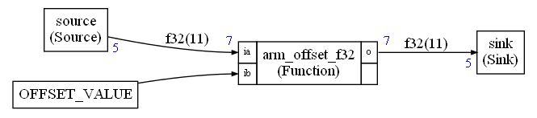

# README

This example is inside the folder `examples/simpledsp` of the Compute graph folder. Before reading this documentation you need to understand the principles explained in the [simple example without CMSIS-DSP](../simple/README.md)

This example explains how to create a very simple synchronous compute graph with 3 nodes. The difference with the [simple example without CMSIS-DSP](../simple/README.md) is that the `Processing` node has been replaced by a CMSIS-DSP function.



A CMSIS-DSP function can be used as explained so far : by creating a C++ wrapper. It is indeed the only way when you need to integrate functions, like FFT and FIR, that have a state (`arm_cfft_instance_f32` or `arm_fir_instance_f32`). The state is initialized in the constructor of the C++ wrapper and is preserved between successive executions of the `run` function.

But most of CMSIS-DSP functions are pure functions with no state and side effects: They take an input and generate an output.

For instance, the interface of `arm_offset_f32` is:

```c
  void arm_offset_f32(
  const float32_t * pSrc,
        float32_t offset,
        float32_t * pDst,
        uint32_t blockSize);
```

This function is adding an offset to its input array. There is no state to initialize or preserve. To make it easier to integrate functions like that one, it is possible to use those functions directly in the compute graph. No C++ wrapper is needed. The Python will generate the code for calling the function automatically.

This integration is done with the nodes `Unary` and `Binary` defined in `cmsisdsp.cg.scheduler`.

`arm_offset_f32` can be used by creating a node `Binary` in the Python script:

```python
processing = Binary("arm_offset_f32",floatType,7)
```

Functions used with `Binary` must have a type like:

```C
  void binary_function(
  const T* pFirst or T pFirst,
        T* pSecond or T pFirst,
        T *pResult,
        uint32_t numberOfSamplesGenerated);
```

Where `T` is a basic CMSIS-DSP type like `float32_t` ...

Functions used with `Unary` are similar but with just one input.

When the type is `T` only (and not a pointer),  the argument cannot be connected to a FIFO. It occurs, for instance, when some arguments are scalars (offset, scaling ...)

To handle this case, a new kind of node is available : The `Constant` node. A constant node is defined with:

```python
offsetValue = Constant("OFFSET_VALUE")
```

The string `"OFFSET_VALUE"` is a C symbol (variable or `#define`).

As you can see in the picture, the node `OFFSET_VALUE`  has no IO. There is no value displayed close to the node to show the amount of samples generated on an output.

The edge connecting this constant node the the CMSIS-DSP function is not a FIFO : there is no length displayed on this edge since there is no memory buffer allocated for this edge.

You can see in the `graph.py` that a constant node is connected directly. There is no IO property:

```python
the_graph.connect(offsetValue,processing.ib)
```

Here we are using `offsetValue` directly. There is no `.o` property used.

Constant nodes and edges are ignored by the scheduling. But the code generator is using them to replace some arguments with a `C` symbol : variable. `#define` ...

In this example, in `custom.h`, we have defined:

```C
#define OFFSET_VALUE 2.0f
```

The code generated to call the `arm_offset_f32` is:

```c
float32_t* i0;
float32_t* o2;
i0=fifo0.getReadBuffer(7);
o2=fifo1.getWriteBuffer(7);
arm_offset_f32(i0,OFFSET_VALUE,o2,7);
cgStaticError = 0;
```

Note that constant nodes can only be used with function nodes like `Binary` and `Unary`. The Python will not (currently) check that a constant node is connected only to function nodes. 

There is another function node : `Dsp`.

It is a work in progress. `Dsp` attempts to detect if a CMSIS-DSP node is unary or binary and use the sample type to generate the function name.

For instance, you would write:

```python
scale=Dsp("scale",floatType,NB)
```

instead of:

```python
scale=Binary("arm_scale_f32",floatType,NB)
```

`Dsp` node is currently detecting only a very small subset of the `Binary` nodes. So, it is better to use `Binary` for now.

## How to build the example

This example requires CMSIS-DSP. Contrary to the  [simple example without CMSIS-DSP](../simple/README.md), there is no simple `Makefile` to build it. You need to build it like all other examples using `cmake` as explained in the [top level documentation for the examples](../README.md).

## Expected output

Python output:

```
Schedule length = 19
Memory usage 88 bytes
```

Executable output:

```
Start
Source
Source
Sink
2
3
4
5
6
Source
Sink
2
3
4
5
6
Source
Source
Sink
2
3
4
5
6
Sink
2
3
4
5
6
Source
Sink
2
3
4
5
6
Source
Sink
2
3
4
5
6
Sink
2
3
4
5
6
```

