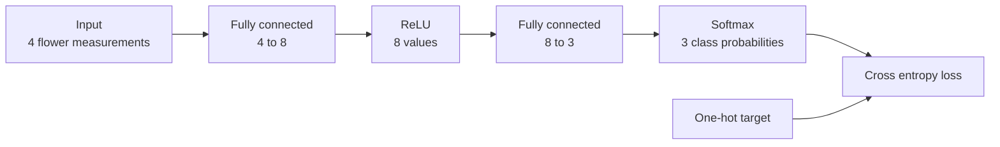

# CMSIS-DSP C++ examples

The examples demonstrate the CMSIS-DSP C++ API and its autodiff extension.
Each source file defines its own `main`, so enable only one example at a time
in `dsppp/example.cproject.yml` by commenting and uncommenting its `file` line.

## Expression examples

- `dot_product.cpp` evaluates a fused vector expression ending in a dot
  product.
- `vector_op.cpp` demonstrates floating-point and fixed-point vector
  expressions, vector views, and strided views.
- `matrix_op.cpp` demonstrates matrix expressions and row and column views.

## Autodiff examples

- `autodiff_example.cpp` is a minimal fully connected layer followed by ReLU.
  It runs one forward and backward pass and prints the resulting gradients.
- `autodiff_regression.cpp` trains a cubic polynomial to approximate a sine
  wave. It demonstrates RMSProp, reusable graphs, parameter freezing, and
  saving model parameters.
- `autodiff_lms.cpp` identifies an unknown FIR filter with a per-sample LMS
  update expressed as quadratic error, reverse differentiation, and SGD. It is
  an educational demonstration; the specialized CMSIS-DSP LMS functions are
  more efficient for production filtering.
- `autodiff_iris.cpp` trains a small classifier on the Iris flower dataset.
  It uses Adam and reserves 30 of the 150 samples for a final test that is not
  used during training.
- `autodiff_fully_connected_qat.cpp` demonstrates quantization-aware training
  of a fully connected layer for later deployment with CMSIS-NN or Ethos-U.

### Iris classifier

The Iris classifier contains two fully connected layers. Cross entropy is the
training loss and is not part of the network used for inference.



The dataset is stored as floating-point measurements in `iris_data.hpp` and
normalized when each sample is loaded. Its license and attribution are in
`LICENSE-Iris.txt`.

## Building an example

After selecting one source in `example.cproject.yml`, the Cortex-M55 virtual
target can be built with:

```text
cbuild test.csolution.yml --context example.Release+VHT-Corstone-300
```
