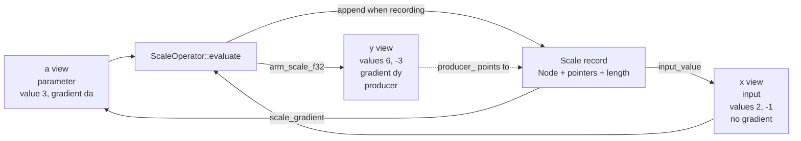
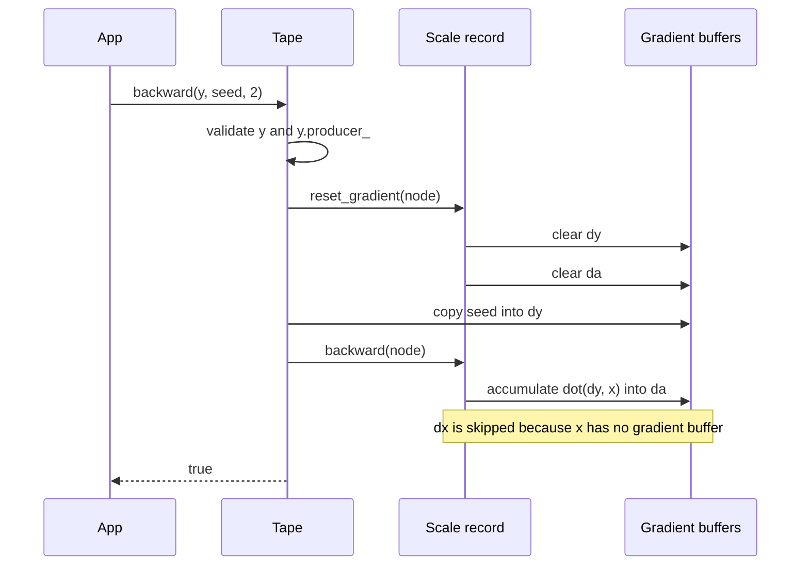

# Worked implementation flow: `y = a * x`

This example follows one vector scaling operation through the public API,
`ScaleOperator`, and the internals of `reverse.hpp`. It uses a trainable scalar
`a`, a constant input vector `x`, and an output vector `y`:

```text
y[i] = a * x[i]
```

The scale operator is used instead of element-wise `MultiplyOperator` because
`a` has one element while `x` and `y` have several.

## Complete example

```cpp
#include <dsppp/autodiff/reverse.hpp>
#include <dsppp/autodiff/operators/scale.hpp>

using namespace arm_cmsis_dsp::autodiff;

int main()
{
    Arena<512, float> arena;
    Tape<float> &tape = arena.tape();
    tape.register_operator<ScaleOperator<float>>();

    float a_value = 3.0F;
    float x_value[] = {2.0F, -1.0F};
    float y_value[2] = {};

    BufferView<float> a = tape.parameter(a_value);
    BufferView<float> x = tape.input(x_value);
    BufferView<float> y = tape.output(y_value);

    y = scale(x, a); // Forward result: {6, -3}.

    const float seed[] = {1.0F, 1.0F};
    if (!tape.backward(y, seed, 2U))
        return 1;

    // a.gradient(0) == 1*2 + 1*(-1) == 1
    // x.has_gradient() == false
    return 0;
}
```

The seed is the vector supplied as input to `backward()`. It is copied into
`y`'s gradient buffer before reverse traversal starts. Because `y` is a vector,
each output element has its own derivative with respect to `a`:

```text
dy/da = {x[0], x[1]} = {2, -1}
```

The seed specifies how those output contributions are combined. With
`seed = {1, 1}`, the backward pass computes
`a.gradient(0) = 1*2 + 1*(-1) = 1`. A seed of `{1, 0}` would select only
`y[0]` and produce `a.gradient(0) = 2`. One call does not build the complete
derivative vector for `y`; it propagates the selected scalar projection of the
vector output. No loss function is present in this example. Training normally
ends in a scalar loss, for which
`backward(scalar_output)` uses the default seed `1`.

## Objects before the forward pass

`Arena<512, float>` contains the storage array and constructs a `Tape<float>` over it. The
tape initially has `used_ == 0`, `tail_ == nullptr`, `recording_ == true`, and
`status_ == Status::ok`.

The three registrations create non-owning views:

| View | `values_` points to | `gradients_` | `role_` | `producer_` |
| --- | --- | --- | --- | --- |
| `a` | `a_value` | one arena `float` | `parameter` | null |
| `x` | `x_value` | null | `input` | null |
| `y` | `y_value` | two arena `float`s | `intermediate` | null |

`parameter()` and `output()` allocate and zero gradient arrays. `input()` does
not allocate one because the application did not request a derivative for
`x`. The value arrays themselves remain entirely caller-owned.

`producer_` answers "which recorded node last produced this view?" Inputs and
parameters have no producer in this graph. It is initially null for `y` and is
set only after a record has been appended successfully.

## Field map for `reverse.hpp`

The core member names have these responsibilities:

| Type | Member | Meaning |
| --- | --- | --- |
| `BufferView` | `values_` | Pointer to caller-owned forward values. |
| `BufferView` | `gradients_` | Pointer to its adjoint, or null for an input. |
| `BufferView` | `length_` | Number of scalar elements. |
| `BufferView` | `tape_` | Owning tape identity used for compatibility checks. |
| `BufferView` | `producer_` | Last successfully recorded node that wrote this view. |
| `BufferView` | `role_` | `input`, `parameter`, or `intermediate`. |
| `Tape` | `storage_`, `capacity_` | Start and byte size of caller-supplied arena storage. |
| `Tape` | `used_` | Current byte offset for the next aligned allocation. |
| `Tape` | `tail_` | Most recently appended node. |
| `Tape` | `recording_` | Whether forward operations append records. |
| `Tape` | `status_` | Sticky first-error status. |
| `Tape` | `graph_begin_`, `graph_marked_` | Saved allocation offset and validity flag used by graph rewinding. |
| `Tape` | `registered_operators_` | Fixed hash table of registered operator type tokens. |
| `detail::Node` | `previous` | Link to the preceding record. |
| `detail::Node` | `backward` | Function pointer for the record's local reverse rule. |
| `detail::Node` | `reset_gradient` | Function pointer that clears buffers used by that rule. |

`OperatorAccess` is the narrow bridge used by separate operator headers to
read these private fields, validate views, report failure, append a record, and
set an output producer. It keeps operator-specific code out of `Tape` itself.

## Forward assignment

The statement

```cpp
y = scale(x, a);
```

executes these steps:

1. `scale(x, a)` returns a small `ScaleExpression` containing copies of the two
   non-owning views. Only their pointers and metadata are copied; the `x` and
   `a` value buffers are not copied.
2. `BufferView::operator=` calls `ScaleExpression::evaluate(y)`.
3. The expression calls `ScaleOperator::evaluate(y, x, a)`.
4. The operator clears `y.producer_`. This prevents an old record from being
   mistaken for the producer if validation or allocation fails.
5. `OperatorAccess::require<ScaleOperator>(tape)` checks the fixed registry.
6. Validation checks that all views belong to the same tape; `x` and `y` have
   the same length; `a` is a one-element parameter with a gradient; and value
   and gradient buffers do not alias illegally.
7. `arm_scale_f32` computes `{3*2, 3*(-1)}` into `y_value`, giving `{6, -3}`.
8. Because recording is enabled and the output is nonempty, the operator asks
   `OperatorAccess::append` for a `ScaleOperator::Record` in the arena.

The record contains a `detail::Node` as its first member, followed by only the
pointers and length required by the local derivative:

```text
node
output_gradient -> y.gradients()
input_value     -> x.values()
input_gradient  -> null
scale_value     -> a.values()
scale_gradient  -> a.gradients()
length          = 2
```

`Tape::append` aligns arena storage, constructs the record in place, installs
the `backward` and `reset_gradient` function pointers, and links the new node:

```cpp
record->node.previous = tail_;
tail_ = &record->node;
```

For this one-operation graph, `previous` is null. Finally,
`y.producer_ = &record->node` marks this record as the origin of `y`.



## What the node links mean

Every record begins with the same three-field `detail::Node`: `previous`,
`backward`, and `reset_gradient`. `previous` links records in creation order.
If a later operation computes `z` from `y`, its node points to the scale node:

```text
z.producer_ -> z record -> scale record -> null
```

The link is chronological, not a list of a node's operands. Operand
relationships are represented by the value and gradient pointers stored in
each operator-specific record. Starting at the requested output's `producer_`
prevents traversal into records created after that output. Earlier unrelated
records can be visited, but their output gradients are zero, so their local
rules make no contribution.

## `backward(y, seed, 2)`

`Tape::backward` performs three phases.

### 1. Validate the root

The tape must still be good; `y` must belong to this tape and have valid value
and gradient storage; `y.producer_` must be non-null; and the seed pointer and
length must match `y.length_`. A value-only result produced while recording was
disabled has no producer and is therefore rejected.

### 2. Reset graph gradients, then install the seed

Starting at `y.producer_`, the first reverse walk calls each node's
`reset_gradient` function. For the scale record this sets:

```text
dy = {0, 0}
da = 0
```

It would also clear `dx` if `x` had gradient storage. The tape then copies the
caller seed into the root output gradient:

```text
dy = {1, 1}
```

Resetting before seeding is essential: otherwise resetting the root record
would erase the seed. Clearing all reachable buffers also makes repeated calls
to `backward()` deterministic instead of unintentionally accumulating an
earlier reverse pass.

### 3. Traverse backward

The second reverse walk calls the node's operator-specific `backward` function.
For `y[i] = a*x[i]`, the chain rule is:

```text
da    += sum(dy[i] * x[i])
dx[i] += a * dy[i]
```

The implementation evaluates the first expression with the CMSIS-DSP C++ dot
operation:

```text
da = 0 + dot({1, 1}, {2, -1}) = 1
```

`input_gradient` is null because `x` came from `tape.input()`, so the `dx`
update is skipped. If `x` were an intermediate output, it would have gradient
storage and the same rule would accumulate `{3, 3}` into it; an earlier node
would then consume that gradient when reverse traversal reached it.



## Why records store pointers rather than views

The operator record retains only the data needed later: raw non-owning
pointers, dimensions, small metadata, and the common node prefix. It does not
own or copy tensors and does not retain the temporary expression object. This
keeps record size independent of the numerical buffer length. Gradient storage
still costs one scalar of the selected type (`T`) per parameter or intermediate
element.

This is also why the caller must preserve values until the reverse pass. The
scale rule rereads `x_value` and `a_value`; changing either after the forward
pass would differentiate a different computation from the one whose `y_value`
was calculated.
