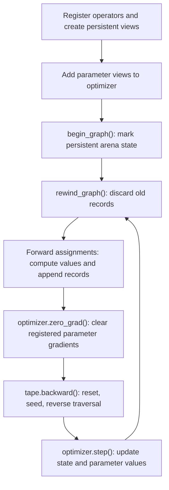

# Training loop

The application owns the model, data, outputs, and loop. The tape records one
evaluation of the model, computes gradients, and then an optimizer changes the
parameter values.

## Complete linear-regression step

This example fits `prediction = coefficient * feature + bias` to one sample.
Every variable used by the loop is declared here.

```cpp
#include <dsppp/autodiff/reverse.hpp>
#include <dsppp/autodiff/operators/add.hpp>
#include <dsppp/autodiff/operators/multiply.hpp>
#include <dsppp/autodiff/operators/quadratic_error.hpp>
#include <dsppp/autodiff/optimizers/rmsprop.hpp>

using namespace arm_cmsis_dsp::autodiff;

int main()
{
Arena<1024> arena;
Tape &tape = arena.tape();
tape.register_operator<MultiplyOperator>();
tape.register_operator<AddOperator>();
tape.register_operator<QuadraticErrorOperator>();

float coefficient_value[] = {0.0F};
float bias_value[] = {0.0F};
float feature_value[] = {2.0F};
float target_value[] = {5.0F};
float product_value[] = {0.0F};
float prediction_value[] = {0.0F};
float loss_value[] = {0.0F};

BufferView coefficient = tape.parameter(coefficient_value);
BufferView bias = tape.parameter(bias_value);
BufferView feature = tape.input(feature_value);
BufferView target = tape.input(target_value);
BufferView product = tape.output(product_value);
BufferView prediction = tape.output(prediction_value);
BufferView loss = tape.output(loss_value);

RMSProp<2, 2> optimizer(1.0e-3F);
optimizer.add(coefficient);
optimizer.add(bias);

tape.begin_graph();
for (std::size_t step = 0; step < 100U; ++step)
{
    if (!tape.rewind_graph())
        break;

    product = coefficient * feature;
    prediction = product + bias;
    loss = quadratic_error(prediction, target);

    optimizer.zero_grad();
    if (!tape.backward(loss) || !optimizer.step())
        break;
}
return tape.good() && optimizer.good() ? 0 : 1;
}
```

## The flow, in order

### 1. Set up fixed state

Register operator types once, create all persistent views, construct the
optimizer, and add each trainable parameter view. `RMSProp<2, 2>` reserves
state for two scalar values in at most two separately added views: the
one-element `coefficient` view and the one-element `bias` view.

### 2. Mark persistent arena allocations

`begin_graph()` records the arena position after the persistent gradient
buffers. It also starts a fresh record chain. Call it only after creating the
views that must survive between iterations.

### 3. Rewind before an iteration

`rewind_graph()` discards the previous iteration's operation records by moving
the arena position back to the mark. Parameter/output views and their gradient
arrays remain valid. It resets tape status, enables recording, and clears the
record-chain tail.

### 4. Run and record the forward graph

Each assignment computes caller-owned output values immediately and appends a
small record containing the pointers needed by its derivative rule. The graph
must be reevaluated every iteration because parameter values change after
`step()`.

Here the forward values are:

```text
product[0]    = coefficient[0] * feature[0]
prediction[0] = product[0] + bias[0]
loss[0]       = (prediction[0] - target[0])^2
```

### 5. Clear optimizer-managed parameter gradients

`optimizer.zero_grad()` clears every parameter gradient registered with the
optimizer. `Tape::backward()` also resets gradients referenced by the recorded
graph before installing its seed, so for a fixed, successful graph this call
is usually redundant. It is nevertheless useful explicit training-loop
hygiene: it also clears registered parameters omitted by a conditional graph,
and it prevents stale gradients from reaching `step()` if graph structure is
changed. Call it before `backward()`, not after, because after backward those
buffers contain the gradients that `step()` must consume.

### 6. Run reverse propagation

`backward(loss)` uses the default scalar seed `d(loss)/d(loss) = 1`. It first
resets graph gradient buffers, seeds the loss gradient, and visits operation
records in reverse creation order. Contributions use `+=`, so a parameter used
by several nodes receives their sum.

For this graph:

```text
d_loss/d_prediction = 2 * (prediction - target)
d_loss/d_coefficient = d_loss/d_prediction * feature
d_loss/d_bias = d_loss/d_prediction
```

Inputs have no gradient buffers, so derivatives for `feature` and `target` are
not retained.

### 7. Update parameters

`optimizer.step()` reads the gradients, updates its fixed-size state, and then
changes `coefficient_value` and `bias_value` in place. The next iteration's
forward pass therefore uses the new parameter values.



## Batch accumulation

To update once per batch, record every sample's prediction before constructing
one loss over the complete prediction and target buffers. Scalar per-sample
output views can share slices of persistent vector gradient buffers. The
regression example in `dsppp/Examples/autodiff_regression.cpp` demonstrates
this pattern with named `coefficients`, `bias`, `polynomial`, `prediction`,
`target`, and `loss` views.

## Inference

Inference still runs the operator forward kernels but does not need records:

```cpp
{
    RecordingScope inference(tape, false);
    product = coefficient * feature;
    prediction = product + bias;
    const float result = prediction_value[0];
    (void)result;
}
```

The previous recording state is restored at the closing brace. See
[Concepts and memory model](concepts.md#recording-and-recordingscope) for the
name and lifetime behavior.
